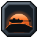
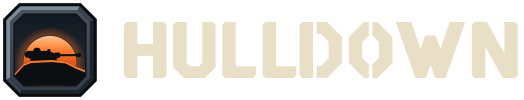
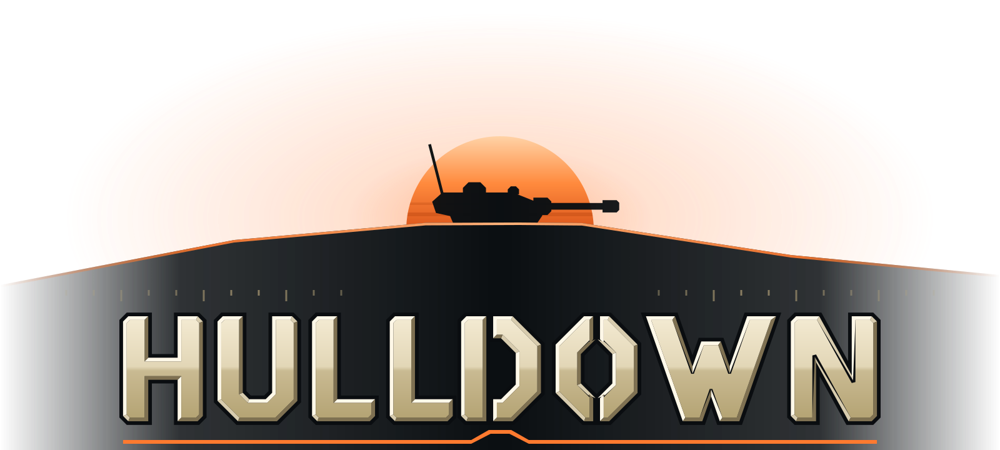

# HULLDOWN: Brand & Art Direction Guide

> Status: **authoritative** for every visual and written surface of the game: logos, icons, UI, HUD,
> VFX, map thumbnails and UI copy. Art, UI and VFX work must follow this guide. To deviate, update
> the guide in the same change.
>
> Sources of truth: colour tokens in `tools/art/hdart/tokens.py` (mirrored to
> `assets/brand/tokens.json`), shapes in `tools/art/hdart/*.py`, and the generated SVGs in `assets/`.
> The pipeline is described in [`tools/art/README.md`](../../tools/art/README.md).

---

## 1. Identity concept

**Hull-down** is the position every tank commander looks for: the hull sheltered behind a crest,
only the turret showing over the ridge, the gun covering the valley. It stands for patience,
positioning and reading terrain, which is the game we want people to play. The whole identity is
built from three elements of that one image:

| Element | Visual | Where it appears |
|---|---|---|
| **The ridge line** | A low, asymmetric crest drawn as one rim-lit stroke in `accent.dusk` | The emblem, the loading logo horizon, the active-tab underline notch, the CTA chamfer, the tier XI crest, the high-command rank mark |
| **The turret** | An original turret silhouette (sloped front, bustle, cupola, muzzle brake) facing right, showing only above the crest | The emblem and the loading logo |
| **Dusk** | A low sun behind the ridge, warm against cold gunmetal | The emblem sun, the brand accent, loading screens and the key-art grade |

 

**Mood words:** *disciplined, weathered, tactical, warm-against-cold, readable.*
**HULLDOWN is not:** cartoony or toy-like, a grimdark gore sim, a real-world army or nation, neon
sci-fi, or a copy of any other tank game.

**Look in one line:** stylized realism. Chunky, honest silhouettes that feel native to Roblox,
chamfered steel instead of soft rounded blobs, two tones plus one highlight, and one warm accent
on a cold gunmetal field.

### 1.1 IP guardrails (non-negotiable)

Everything is original. In particular, HULLDOWN never uses:

* **Class markers built on rhombus or diamond shapes**, or on the inverted-triangle and square
  convention, or on stacked bars whose count grows with vehicle weight. Our class silhouettes are an
  eye, a hexagon, a shield, a casemate trapezoid and an arch (§6.6).
* **Chevrons as a main motif outside their owners.** Stacked chevrons mean XP (currencies) and
  enlisted rank; the HUD's single crest chevron means "spotted" (§8.8). Faction emblems and class
  symbols never build their silhouette from chevrons, so a chevron stack always reads as progression.
* **Coin currencies.** "Gold coin" premium currency and "silver coin" credits are out. Our premium
  currency, Bullion, is a stamped **ingot**. Credits are a **hex-nut token** with a stencil C, and
  Campaign Tokens are an **operations-map counter**. XP uses **double chevrons**, never stars.
* Another game's logo letterforms, fonts, tier-badge styling, garage layouts or UI chrome.
* **Real nations' flags, roundels, crosses, stars (red or otherwise), eagles, rising-sun ray
  fields, or any extremist symbol.** Our six factions are fictional and use fictional heraldry
  (§6.5). Desert rays are short compass wedges on an ochre sun, never a red ray field. Mountain
  heraldry never uses a cross. Northern heraldry is an ice crystal, never a star.
* **A light bulb or lamp** for the "you are spotted" alert. We use the dusk crest chevron (§8.8).
* **Another game's HUD and damage-panel art**: its module and crew damage icons, shell icons,
  medal and mastery designs. Our module glyphs, ammo silhouettes, crew pictograms and mastery
  badges follow their own rules (§6.8–§6.13).
* **The red cross** (a protected emblem) for anything medical. First aid is a **bone plus on a
  green chamfered tile**. No laurel wreaths or ribbon bars copied from real decorations, and no
  stars as rating or favourite marks (favourite is a bookmark ribbon; the damage stat is a pierced
  plate, never a star burst).

---

## 2. Tone of voice (UI copy)

HULLDOWN speaks like a calm, competent field officer on the radio: **short, specific, unhurried**.
The audience is a broad Roblox audience, so the copy is serious but never grim, and never
mocking.

| Rule | Do | Don't |
|---|---|---|
| Verb first on actions, two words max on buttons | `TO BATTLE`, `RESEARCH`, `MOUNT`, `REPAIR ALL` | `Click here to start a battle!` |
| Numbers before adjectives | `+1,240 Credits` · `Reload 7.4 s` | `You earned a lot of credits` |
| State the fix, not just the fault | `Not enough Credits. You need 12,400 more.` | `Purchase failed.` |
| Sentence case for body, UPPERCASE only for display headings, tabs and CTAs | `Crew training complete.` | `CREW TRAINING COMPLETE!!!` |
| Neutral military verbs | `Destroyed`, `Disabled`, `Spotted`, `Captured` | `Killed`, `Murdered`, `Rekt`, `Owned` |
| No real conflicts, nations, politics or memes | `Northern Federation T-IV` | real place names, real unit names, memes |
| One exclamation mark per screen, at most (victory only) | `VICTORY` · `Mission complete` | `Awesome!! Great job!!` |
| Metric units, consistent precision | `54 km/h`, `212 mm`, `0.34 m`, `2.1 s` | `33.5 mph`, `212.000mm` |

* **Numbers:** comma thousands separators (`12,400`). Keep timers at one decimal under 10 s
  (`7.4 s`). Show deltas with an explicit sign and a state colour: `+18 mm` in `state.success`,
  `−0.4 s` in `state.success` when lower is better.
* **Currency:** always pair the icon with the amount (`[icon] 12,400`). Never show the icon alone
  in a price.
* **Tiers:** write the roman numeral (`Tier VII`). Use the badge where space allows.
* **Names:** factions in UPPERCASE in headings (`IRON UNION`) and Title Case in body text
  (`Iron Union`). Vehicle designations follow the content data exactly.
* **Errors and confirmations:** the title says what happened (`Purchase failed`). The body says why
  and what to do next. Destructive actions name the thing (`SELL AVR-4 LANCER`), never a bare `OK`.
* **Localization:** leave 35 % horizontal slack in every label. Never bake words into images (all
  of our art is wordless, apart from the brand lockups).

---

## 3. Colour system

The authoritative values are in `tools/art/hdart/tokens.py`, exported to `assets/brand/tokens.json`.
UI code must reference **token names**, never raw hex values.

**Usage ratio:** about 70 % gunmetal surfaces, 20 % text and steel chrome, 7 % semantic colour
(states, teams, rarity), **≤ 3 % `accent.dusk`**. Dusk is a privilege: one primary CTA per
screen, focus rings, the active-tab notch and brand moments.

### 3.1 Surfaces, borders, text

| Token | Hex | Use |
|---|---|---|
| `bg.abyss` | `#0A0D10` | Loading and cinematic backdrop, letterbox |
| `bg.base` | `#0F1418` | App background behind garage panels, HUD map background |
| `bg.panel` | `#151C21` | Standard panel |
| `bg.raised` | `#1C252C` | Cards, list rows, hovered panel |
| `bg.inset` | `#0C1013` | Wells, inputs, progress and health-bar tracks |
| `bg.selected` | `#26323B` | Selected card, active tab body |
| `bg.scrim` | `#0A0D10CC` | Modal scrim (80 % alpha) |
| `border.subtle` | `#25303A` | Default 1 px panel border, dividers |
| `border.strong` | `#3A4855` | Input borders, secondary buttons, focus-less outlines |
| `border.bevel_hi` | `#56687A` | 1 px top bevel highlight on raised metal |
| `border.bevel_lo` | `#070A0C` | 1 px bottom bevel shadow |
| `text.primary` | `#EAEFF2` | Body and primary labels (14.9:1 on panel) |
| `text.secondary` | `#A8B5C0` | Secondary labels, stat names (8.2:1) |
| `text.tertiary` | `#76838F` | Hints and timestamps, ≥ 16 px only (4.4:1) |
| `text.disabled` | `#4B5661` | Disabled labels (decorative contrast only) |
| `text.inverse` | `#0C1013` | Labels on dusk and light fills (7.4:1 on dusk) |
| `text.brand` | `#E9DFC6` | Bone. Display headings and brand moments only |

### 3.2 Brand and accents

| Token | Hex | Use |
|---|---|---|
| `brand.bone` | `#E9DFC6` | Wordmark, display headings |
| `brand.khaki` | `#B9A77C` | Sub-lockups (`COMMAND GARAGE`), decorative rules, rangefinder ticks |
| `brand.olive` | `#5E6640` | Enlisted insignia field, camo accents, olive-drab UI ornaments |
| `accent.dusk` | `#FF7A2F` | **The** accent: ridge line, primary CTA, focus ring, active-tab notch |
| `accent.dusk_hi` | `#FFA066` | Hover and glow on dusk elements |
| `accent.dusk_lo` | `#C9541A` | Pressed dusk, dusk on light backgrounds |
| `accent.steel` | `#8FA3B5` | Neutral interactive chrome: sliders, toggles, scrollbars |

### 3.3 States

Never rely on colour alone. Every state colour ships with an icon or a label.

| Token | Hex | Icon pairing |
|---|---|---|
| `state.success` | `#3FCB7A` | check / up-delta |
| `state.warning` | `#F2C230` | warning triangle |
| `state.danger` | `#EF4747` | octagon-bang / down-delta |
| `state.info` | `#4AA8F0` | info "i" in a square |

### 3.4 Teams and colour-blind schemes

Players pick a scheme in Settings → Accessibility, and every team-coloured element switches to it.
**Marker shapes never change**: the class glyph, the self arrow and the platoon pip number are
shape-based cues that work without colour.

| Scheme | Ally | Enemy | Platoon | Self |
|---|---|---|---|---|
| default | `#47D16C` | `#F0443A` | `#FFD23F` | `#F4F7F9` |
| deuteranopia | `#3F8CFF` | `#FF8719` | `#BF1C6D` | `#F4F7F9` |
| protanopia | `#3F8CFF` | `#FFBE19` | `#BF4C5F` | `#F4F7F9` |
| tritanopia | `#418CD8` | `#EF3F34` | `#7F33CC` | `#F4F7F9` |

Other team tokens: `team.neutral` `#B3BDC6` (uncaptured bases, neutral objects) and
`team.destroyed` `#5D666E` (wrecks; always paired with the wreck glyph at 60 % opacity).

`tools/art/check_palette.py` verifies these schemes with Machado (2009) simulation and CIEDE2000.
For its intended viewer, every pair of roles is at least **ΔE 20** apart: deuteranopia 33.5,
protanopia 32.8, tritanopia 33.7, default under normal vision 30.3. Every role also stays at least
**3:1** against `bg.base`. The CVD platoon colour is deliberately darker than the team colours,
because lightness is what dichromats separate best.

### 3.5 Rarity (cosmetics, crates, boosters, module grades)

| Token | Hex | Name in UI |
|---|---|---|
| `rarity.common` | `#A9B3BC` | Standard |
| `rarity.uncommon` | `#62C155` | Field |
| `rarity.rare` | `#3E9BFF` | Veteran |
| `rarity.epic` | `#A970FF` | Elite |
| `rarity.legendary` | `#FFB13B` | Legendary |
| `rarity.prototype` | `#FF5A7A` | Prototype |

Rarity appears as a 3 px top edge on the card plus a rarity pip, never as a full-card fill.

### 3.6 Currency

| Currency | Token | Hex | Icon (`assets/icons/currency/`) |
|---|---|---|---|
| Credits (earned) | `currency.credits` | `#E0955A` | `credits.svg`: copper hex-nut token with a stencil **C** (3/4 object) |
| Bullion (premium) | `currency.bullion` | `#F4C653` | `bullion.svg`: tapered gold ingot with a stamped ridge cartouche (3/4 object) |
| Vehicle XP | `currency.vehicle_xp` | `#5BB1F5` | `vehicle_xp.svg`: double chevron over a track run |
| Free XP | `currency.free_xp` | `#B08CFF` | `free_xp.svg`: double chevron in four open arcs (unbound XP) |
| Crew XP | `currency.crew_xp` | `#3FD0BE` | `crew_xp.svg`: double chevron over a padded tanker helmet |
| Campaign Tokens (event) | `currency.campaign_token` | `#EC6A93` | `campaign_token.svg`: thick rose square counter (small corner chamfers, so it never reads as the hexagonal Credits token) stamped with a pennant planted on a summit (3/4 object) |

Amounts are tinted with the currency token at 100 % on panels. Large balances in the header use
`text.primary`, with the coloured icon on the left.

### 3.7 Factions

| id | Name | Primary (enamel) | Secondary (trim) | Text tint |
|---|---|---|---|---|
| `iron_union` | IRON UNION | `#B8492A` | `#59616A` | `#E07A55` |
| `crown_industries` | CROWN INDUSTRIES | `#5A3D8C` | `#D6AA4E` | `#B79BE8` |
| `eastern_armor` | EASTERN ARMOR GROUP | `#1C8582` | `#E9DFC6` | `#4FC9C2` |
| `desert_corps` | DESERT ARMOR CORPS | `#C8933A` | `#7A5530` | `#E8B868` |
| `mountain_republic` | MOUNTAIN REPUBLIC | `#3C7650` | `#F2F5F7` | `#74B98A` |
| `northern_federation` | NORTHERN FEDERATION | `#4F8FCB` | `#EEF6FC` | `#8EC3EE` |

The primaries spread around the hue wheel (rust 13°, ochre 38°, pine 141°, teal 178°, glacier 209°,
royal purple 262°). The two warm faction colours, which are the closest pair in hue, are kept apart
by lightness and by emblem outline, so faction filters and tech-tree headers stay distinct. Use the
**text tint** for faction names on dark panels. Primaries are for enamel and large fills.

### 3.8 Icon materials (two tones plus one highlight)

Every icon is painted only with these materials (`tokens.MATERIALS`): highlight / base / shade, plus
the universal ink `#0A0D10` for keylines and recesses.

| Material | Highlight | Base | Shade | Used for |
|---|---|---|---|---|
| `gunmetal` | `#7E8C99` | `#38434E` | `#1C242B` | Emblem plate, gear ring, tread, command rank field |
| `steel` | `#E2E9EF` | `#9AA7B3` | `#596673` | Tier I–III, anvil, mountain ring, split rings |
| `bone` | `#FFFBF0` | `#E3D8BC` | `#A3936D` | Class symbols, chevrons, blade |
| `khaki` | `#E6D9B4` | `#B4A275` | `#6F6141` | Front dune, sand details |
| `olive` | `#8E9862` | `#5B6339` | `#363C21` | Enlisted ranks, crew helmet |
| `brass` | `#FFE6A0` | `#D3A54A` | `#86641F` | Crown, enlisted rank buttons |
| `bronze` | `#F4C49B` | `#B5774A` | `#6B4227` | Tier IV–VI |
| `silver` | `#FFFFFF` | `#C6CED6` | `#78848F` | Tier VII–VIII, command ranks |
| `gold` | `#FFF0B0` | `#F0BD45` | `#A8741A` | Tier IX–X, high-command ranks, Bullion, XI numerals |
| `obsidian` | `#56626E` | `#1B2228` | `#0B0F12` | Tier XI, high-command field |
| `dusk` | `#FFC08F` | `#FF7A2F` | `#B8460F` | Brand accents, XI crest and keel, sparks |
| `copper` | `#FFD3AD` | `#D98A4B` | `#8C4E22` | Credits |
| `rose` | `#FFD1DF` | `#E2577F` | `#8E2446` | Campaign Tokens |
| `xp_blue` / `xp_violet` / `xp_teal` | see tokens | | | Vehicle / Free / Crew XP chevrons |
| `f_*`, `snow` | see tokens | | | Faction enamels |
| `amber` | `#FFE9A3` | `#F2C230` | `#9C7612` | **Damaged** state (base = `state.warning`), critical-hit gear |
| `signal` | `#FFB3AC` | `#EF4747` | `#8C1D1D` | **Destroyed / injured** state (base = `state.danger`), extinguisher bottle, kill callout |
| `verdant` | `#B8F2CF` | `#3FCB7A` | `#1B7343` | Repair, first-aid tile, mission complete (base = `state.success`) |
| `azure` | `#C3E4FF` | `#4AA8F0` | `#1E5E92` | Info state (base = `state.info`) |
| `ap` / `apcr` / `heat` / `he` | see tokens | | | Shell paint (bases = `ammo.*`); HESH uses `olive` + an `he` band |
| `ember` / `cobalt` / `jade` / `scout` | see tokens | | | Equipment category tiles (bases = `equip.*`) |
| `r_rare` / `r_epic` | see tokens | | | Achievement frame enamels (common = `steel`, legendary = `obsidian` + `gold`) |
| `glass` | `#E4FAFF` | `#5DB4D6` | `#1D4D63` | Lenses, vision blocks, spirit-level vials |
| `canvas` | `#E9E2C8` | `#A99B70` | `#5E5434` | Webbing, pouches, case rims |

### 3.9 Ammunition, equipment and grade colours

| Token | Hex | Use |
|---|---|---|
| `ammo.ap` | `#F28C38` | AP shell paint, AP tag in the damage log |
| `ammo.apcr` | `#86CDF5` | APCR penetrator |
| `ammo.heat` | `#EC4D82` | HEAT shell paint |
| `ammo.he` | `#FFC23D` | HE shell paint |
| `ammo.hesh` | `#9AA35E` | HESH (olive body with an HE band) |
| `ammo.special` | `#F0BD45` | Gold rim and case of special (premium) rounds |
| `equip.firepower` / `equip.survivability` / `equip.mobility` / `equip.scouting` | `#E0583A` / `#4A86C8` / `#3DAA6E` / `#E9C03A` | Equipment category tiles, slot chips, bonus-slot marker |
| `grade.improved` / `grade.experimental` | `#C6CED6` / `#FF8A3D` | Equipment grade overlay frames |

Shell colours echo the tracer table (§10.1), so a round, its tracer and its damage-log tag agree.
Ammo, module-state and category colours are always paired with a shape (§6.8–§6.11).

---

## 4. Typography

All type is set in **Roblox built-in families** loaded with `Font.new`, so there are no custom
font uploads and the type renders identically on PC, console and mobile.

| Role | Family | Asset id | Why |
|---|---|---|---|
| **Display** (headings, numerals, tier and stat figures) | **Oswald** | `rbxasset://fonts/families/Oswald.json` | Condensed grotesque with tall, narrow figures. Fits long vehicle names and big HUD numbers in tight space. Its plain, utilitarian tone works next to our stencil wordmark without imitating it. |
| **UI** (body, labels, buttons, tooltips) | **Builder Sans** | `rbxasset://fonts/families/BuilderSans.json` | Roblox's own UI face. Open apertures, large x-height, tuned for small sizes on every Roblox platform. Regular, Medium, Bold and ExtraBold all ship (`Enum.Font.BuilderSans*`). |
| **Tabular** (timers, ping, comparison tables, damage logs) | **Builder Mono** | `rbxasset://fonts/families/BuilderMono.json` | Fixed-width digits, so changing numbers never jitter. |

```lua
local Fonts = {
	Display = Font.new("rbxasset://fonts/families/Oswald.json", Enum.FontWeight.Bold),
	DisplaySemi = Font.new("rbxasset://fonts/families/Oswald.json", Enum.FontWeight.SemiBold),
	UI = Font.new("rbxasset://fonts/families/BuilderSans.json", Enum.FontWeight.Regular),
	UIMedium = Font.new("rbxasset://fonts/families/BuilderSans.json", Enum.FontWeight.Medium),
	UIBold = Font.new("rbxasset://fonts/families/BuilderSans.json", Enum.FontWeight.Bold),
	Mono = Font.new("rbxasset://fonts/families/BuilderMono.json", Enum.FontWeight.Medium),
}
```

> Verify every face once in Studio's font picker when building the UI kit. If a weight is missing
> from a family, step down one weight (SemiBold → Bold → Medium). Never fake bold with a
> `UIStroke`.

The **HULLDOWN wordmark is never typeset**. It is drawn from vector paths (§5). No font imitates it.

### 4.1 Type scale (px at 1080p reference height)

UI is authored at 1920×1080 and scaled with a root `UIScale = clamp(viewportHeight / 1080, 0.75, 1.5)`.
Don't use `TextScaled` for body copy. It is allowed for hero numerals, with a
`UITextSizeConstraint`.

| Token | Face / weight | Size | Line height | Case | Use |
|---|---|---|---|---|---|
| `display.hero` | Oswald Bold | 72 | 1.00 | UPPER | `VICTORY`, `DEFEAT`, loading headline |
| `h1` | Oswald Bold | 48 | 1.05 | UPPER | Screen titles (`GARAGE`, `RESEARCH`) |
| `h2` | Oswald SemiBold | 36 | 1.10 | UPPER | Section headers, vehicle name in the garage |
| `h3` | Oswald SemiBold | 28 | 1.15 | UPPER | Panel titles, modal titles |
| `h4` | Builder Sans Bold | 22 | 1.20 | Title | Card titles, list headers |
| `body.l` | Builder Sans Medium | 20 | 1.35 | Sentence | Primary body, mission text |
| `body` | Builder Sans Regular | 18 | 1.35 | Sentence | Default body, tooltips |
| `body.s` | Builder Sans Regular | 16 | 1.35 | Sentence | Dense lists, secondary descriptions |
| `label` | Builder Sans Bold | 14 | 1.20 | UPPER | Stat labels, chips, column headers |
| `caption` | Builder Sans Medium | 14 | 1.25 | Sentence | Timestamps, footnotes (`text.secondary`) |
| `num.xl` | Oswald Bold | 56 | 1.00 | – | HUD hit points, match timer, results totals |
| `num.l` | Oswald SemiBold | 32 | 1.00 | – | Garage stat values, currency balances |
| `num.m` | Oswald SemiBold | 22 | 1.00 | – | Inline stats, ammo counts |
| `mono` | Builder Mono Medium | 16 | 1.30 | – | Timers, damage log, comparison tables |
| `micro` | Builder Sans Bold | 12 | 1.10 | UPPER | **HUD numerals and tags only**, never sentences |

### 4.2 Minimum sizes (after scaling, in rendered px or pt)

| Platform | Sentence text | Labels / numerals | Touch / focus target |
|---|---|---|---|
| PC (1080p) | 14 | 12 (HUD numerals only) | – |
| Console (10-foot UI, TV) | 20 | 18 | Focus ring on every interactive element; the console profile scales the whole UI ×1.25 |
| Mobile (phone) | 16 | 14 | 44 × 44 min, 48 × 48 for primary actions; 8 px gap between targets |
| Mobile (tablet) | 15 | 13 | 44 × 44 |

---

## 5. Logo and wordmark

### 5.1 Assets (`assets/brand/`)

| File | Description | Use |
|---|---|---|
| `logo_primary.svg` | Emblem + horizontal wordmark (bone) | Default on dark backgrounds |
| `logo_primary_light.svg` | Same, with the wordmark in `#151C21` | Light backgrounds, store pages |
| `logo_stacked.svg` / `_light.svg` | Emblem above the wordmark | Square-ish placements, splash, social |
| `emblem.svg` | Square app icon / monogram: chamfered gunmetal plate, dusk sun, ridge and turret | Game icon, profile marks, watermarks |
| `emblem_flat.svg` | Same emblem without bevel or window keyline | 32 px and below: favicon-scale, HUD, chat tags |
| `loading_logo.svg` | Cinematic: full-width rim-lit ridge, large sun and turret, metal wordmark, rangefinder ticks, crest underline | Loading and title screens, **dark only** |
| `garage_logo.svg` | `HULLDOWN · COMMAND GARAGE` lockup | Garage header bar |
| `battle_logo.svg` | Compact flat emblem + bridge-less wordmark with keyline | Battle loading card, HUD watermark, results header |



### 5.2 Construction

* **Wordmark** is set in *HULLDOWN Stencil*, an original constructed alphabet (`tools/art/hdart/glyphs.py`).
  It is geometric with no curves: every bowl is an octagon with 45° chamfers. Stencil bridges
  break the counters of **D** and **O**, and the stroke is heavy (stem 24 % of cap height).
  The **W** is four parallel-sided arms of one slope; its middle apex is lowered to 24 % of the cap
  height and cut flat to the width of the feet, so both counters stay open. The **N** is wider than
  the H (82 vs 76 units) with a slightly lighter diagonal, and it is clipped to a chamfered box so
  the diagonal never covers a corner chamfer. Letters are tracked at 12 % of cap height, with
  optical kerning for `LD` (−6) and `OW` (−6) in `glyphs.KERN`.
* **Emblem** sits on a 64 grid: a chamfered square plate (9 px corners) with a 2.4 px bevel and an
  inner window. The sun is centred at (32, 40). The ridge crest sits at y ≈ 38.4, the turret rests
  on the crest with its gun to the right, and a 1.3 px dusk **rim line** runs along the crest *in
  front of* the turret base. That rim line is the brand's signature stroke.
* **Lockup proportions:** primary logo = emblem height E, wordmark cap height 0.56 E, gap 0.24 E.
  Stacked = emblem E, gap 0.15 E, cap 0.35 E.
* **Artwork box:** the emblem plate sits 4/64 E inside its own box, so every lockup file carries the
  same 4/64 E bearing on its other open sides (right; right, left and bottom for stacked). The box
  is optically balanced, and keylines such as the battle logo's are never clipped by the viewBox.

### 5.3 Clearspace and minimum size

* **Clearspace:** keep **X** clear on every side, where X is the wordmark's cap height. For the
  emblem alone, use 1/4 of the emblem width.
* **Minimum sizes:** primary logo 160 px wide (digital) or 35 mm (print). Stacked: 96 px tall.
  Emblem: 24 px. At 32 px and below, use `emblem_flat.svg` (no bevel). Battle logo: 24 px tall.
* The loading logo is designed for 1024 px wide or more. Don't use it below 640 px.

### 5.4 Backgrounds and variants

* **Dark backgrounds** (`bg.*`, darkened key art): primary, stacked or loading versions.
* **Light backgrounds:** use the `_light` files. The emblem keeps its own dark plate on every
  background.
* **Busy imagery:** add a `bg.scrim` band or a 40 % ink vignette behind the logo. Never put the logo
  on unscrimmed gameplay screenshots.
* **One-colour use** (merch, embossing): emblem plate as a solid shape, sun as a cut-out, ridge
  and turret as solid. Dusk orange or bone only.

### 5.5 Don'ts

Don't recolour the sun or ridge line, don't swap dusk for a team colour, and don't rotate, skew,
outline or bevel the flat wordmark. Don't separate the turret from the ridge, mirror the turret
(the gun always points right), or add drop shadows or glows outside the loading treatment. Never
re-typeset HULLDOWN in a font, and never place the wordmark inside a box other than the emblem
plate.

---

## 6. Iconography grammar

### 6.1 Grid

* **Canvas:** 64 × 64 viewBox. **Safe margin:** 4 px. Nothing, including the keyline, leaves 4..60.
  The silhouette itself lives in the **live area 6..58**, because the 2 px keyline grows outward.
  The generator enforces this (`icons.check_safe`).
* **Keyline shapes** (optical sizes): circle Ø 52, square 46, landscape 52 × 34, portrait 34 × 52.
  Heavier shapes such as squares and shields sit one step smaller than circles.
* **Minimap glyphs:** a separate 24 × 24 grid. Silhouette in 2..22, 1.5 px keyline, pure white
  fill, tinted at runtime (`ImageColor3`).

### 6.2 Silhouette first

Every icon must be identifiable **as a solid black silhouette at 24 px**, and as itself at
**32 px**. Interior detail (engravings, inlays) is a bonus that only appears at 48 px and above.
Within a family, members must differ in *outline*, not only in interior marks or colour.

### 6.3 Perspective

| Category | View | Rule |
|---|---|---|
| **Symbols**: classes, factions, tiers, ranks, XP, UI glyphs, markers | **Flat front (orthographic)** | No vanishing points, no 3/4 tilt. Depth comes only from bevel and inlay shading. |
| **Physical objects**: Credits, Bullion, Campaign Tokens, consumables, equipment, shells, crates | **Fixed 3/4 "quarter view"** (`tools/art/hdart/proj.py`) | Orthographic camera at yaw 22° and elevation 38°. Objects rest on their largest flat face. The top face takes the lit gradient and one highlight rim on its front edges. Of the visible sides, the most-lit one takes base, any other lit side a half step from base toward shade (so two lit faces never merge into one flat shape), and unlit sides take shade. |
| **Vehicles** (tech tree, carousel) | Side profile, gun to the right | Matches the brand turret. Tech-tree silhouettes come from the 3D blueprints, with the same keyline and materials. |

Physical objects are built with `tools/art/hdart/solid.py`: extruded polygons and bodies of revolution
projected through the house camera, back-face culled and painted back to front. Curved surfaces get
**analytic band shading**: each ring of a lathe is split where the Lambert term crosses the
highlight / base / half-shade / shade thresholds, so tone edges are smooth lines (a highlight stripe
about 15–30 % across a cylinder), never facet stair-steps. Shells stand upright on their base. Panels
that would vanish lying flat (spall liner, spare track section) stand on an edge, tread or face to
the viewer. Lenses and other glass are drawn as a flat cap with a bevelled `glass` disc and one glint.

### 6.4 Edge, stroke, shading and corners

* **Light** always comes from the **top-left** (45°).
* **Keyline:** 2 px ink `#0A0D10` around every silhouette at 64 px, 1.5 px at 24 px. Inner
  separations between parts use a 0.8–1 px ink line.
* **Edges:** 45° **chamfers** instead of rounded corners. Minimum chamfer 2 px. Typical sizes are
  4, 7 and 9 px. Circles are allowed for true discs (wheels, sun, buttons). Pill shapes and soft
  blobs are not.
* **Corner radii in UI:** 0 (chamfer via 9-slice) or a 4 px `UICorner` fallback. Never above 8 px.
* **Minimum feature size:** 3 px at 64, so it survives as 1.5 px at 32. Gaps between features ≥ 2 px.
* **Shading:** two tones plus one highlight. A **bevel** (2 px, or 1–1.6 px on small parts) is split
  into facets. Facets facing the light get the material highlight, facets facing away get the
  shade, and edge-on facets get the base. The face carries a subtle base gradient (top 22 % toward
  highlight, bottom 18 % toward shade). Raised parts (**inlays**) cast a 1.2 px ink shadow to the
  lower-right. Cut-in parts (**engravings**) are an ink recess with a 1 px lit lip on the
  lower-right.
* **No** blurs, outer glows, noise, photo textures or gradients across more than one material.
  The exceptions are the brand dusk glows (the emblem's sun halo, the loading-logo sky glow) and
  the tier XI glow. Each is a radial gradient, not a blur, and stays behind the silhouette it lights
  (the loading glow is clipped to the sky).

### 6.5 Category colour coding

| Category | Material language | Notes |
|---|---|---|
| Brand | gunmetal + dusk + bone | Only brand marks use the turret silhouette |
| Factions | Faction enamel + one metal trim | Each emblem owns a unique outline (§6.6) |
| Classes | Bone, flat symbol | Tinted per context: neutral bone, premium = gold via `ImageColor3` multiply, elite = dusk |
| Minimap | White + ink keyline | Team colour applied at runtime |
| Tiers | Material escalates: steel → bronze → silver → gold → obsidian | Plate escalates too (§6.6) |
| Ranks | Olive (enlisted) → gunmetal and silver (command) → obsidian and gold (high command) → obsidian, gold and dusk (marshal) | Counted marks: chevrons, then pips, then the brand mark |
| Currency | Signature colour per currency (§3.6) | Objects in 3/4 view, XP as symbols |
| States / UI glyphs | Single state colour on ink | Monochrome, no bevel below 24 px |
| UI / HUD glyphs, minimap markers, reticle, marker frames | White + ink keyline | Tinted at runtime (`ImageColor3`): team colour, `text.*`, `accent.dusk` or `state.*` |
| Ammunition | Type paint (`ammo.*`) on a gunmetal case | Special rounds: gold case + gold rim (§6.10) |
| Modules / crew | `steel` / `olive` normal → `amber` damaged → `signal` destroyed or injured | Each state also changes the outline (§6.8) |
| Consumables | Functional material per item (olive tools, bone medical, signal bottles, dusk fuel) | 3/4 objects; `_large` = two units |
| Equipment | Natural materials per item; category tiles in `equip.*` | Grade overlays: silver brackets / dusk frame (§6.11) |
| Hit results | VFX colour language (§10.2): dusk penetration, ice ricochet, steel blocked, amber crit, signal kill | Pre-coloured callouts |
| Achievements | Rarity enamels (steel, `r_rare`, `r_epic`, obsidian + gold) with bone emblems | Mastery: bronze → silver → gold → obsidian + dusk |
| Missions | Bone paper, gunmetal clips, khaki maps, one accent | Dusk = time-limited / special, verdant = done |

### 6.6 Families

**Factions** (`assets/icons/factions/`):

| id | Emblem | Outline | Rationale |
|---|---|---|---|
| `iron_union` | Anvil on a rust-enamel disc inside a 12-tooth gunmetal gear, with three forge sparks | Toothed circle | Industrial might, heavy armor |
| `crown_industries` | Brass three-point crown with a purple enamel field, on a brass band carrying a purple cog jewel and two slots | Crown | Precision manufacturing, corporate-royal |
| `eastern_armor` | Bone spearhead blade (ground spine) rising from two teal wings of three stepped feathers each, joined in a pointed teal tail (no grip or crossguard, so it never reads as a winged dagger) | Winged spearhead | Mobility, aggressive alpha strike |
| `desert_corps` | Ochre compass-sun (five wedges, none below the horizon) over two wind-blown dunes (long windward slope, sharp crest, steep slip face), umber behind and sand in front | Rayed sun over a dune base | Long-range open terrain, heat |
| `mountain_republic` | Three pine-green peaks with zig-zag snowcaps breaking out of a steel ring with a sky-blue field and an engraved valley groove; ring Ø 46 so it carries the same optical mass as the gear and crystal | Peaks over a ring | Terrain mobility, alpine federation |
| `northern_federation` | Six-armed glacier-blue ice crystal with a snow-white hex core | Hexagonal crystal | Survivability, extreme weather |

**Classes** (`assets/icons/classes/`, minimap twins in `assets/icons/minimap/class_<id>.svg`).
These deliberately avoid the rhombus, inverted-triangle and square conventions:

| id | Silhouette | Meaning | Interior (64 px only) |
|---|---|---|---|
| `light` | **Spotter's eye**: horizontal almond | Scouting, vision | Pupil ring |
| `medium` | **Flat-top hexagon** | All-rounder, balanced | Horizontal slot |
| `heavy` | **Bastion shield**: flat top, point down | Front-line armor | Engraved inner shield contour (a second armor layer) |
| `td` | **Casemate**: low, wide trapezoid | Ambush, long gun | Muzzle ring |
| `artillery` | **Trajectory arch over an impact point** | Indirect fire | – |

The five read apart by outline alone at 16 px: almond, hexagon, shield, low trapezoid, arch.

**Tiers** (`assets/icons/tiers/tier_01..11.svg`): a chamfered "data plate" with roman numerals
built from the stencil paths and engraved (cut-in, ink) into the metal.

| Tiers | Material | Plate features |
|---|---|---|
| I–III | Steel | Plain plate |
| IV–VI | Bronze | Side notches |
| VII–VIII | Silver | Notches + crest tab with two rivets |
| IX–X | Gold | Narrower plate + crest + side fins |
| **XI** | **Obsidian with gold inlaid numerals** | Dusk inner rim, tall dusk crest with an engraved ridge mark, dusk keel point, radial dusk glow. It is the only tier with raised (not engraved) numerals and the only one that glows. |

**Ranks** are covered in §7. **Currency** is covered in §3.6. Module and crew states, ammunition,
the special treatment, equipment, UI / HUD glyphs and achievements follow §6.8–§6.13; every icon
key, file and intended use is listed in the generated [`assets/icons/INDEX.md`](../../assets/icons/INDEX.md).

### 6.7 New icon checklist

An icon ships only when every box is ticked on the `render_svgs.py` contact sheet:

- [ ] Built in code (`tools/art/hdart/`) on the 64 grid (24 for minimap markers). `generate_svgs.py --check` passes (viewBox, paths only, < 40 KB, listed in INDEX.md).
- [ ] Silhouette plus keyline inside 4..60. The silhouette is in the live area 6..58. No keyline
      mitre (sharp tip) touches the canvas edge.
- [ ] Recognizable as a solid silhouette at 24 px, and as itself at 32 px, on **both** the dark and
      light panels.
- [ ] Outline differs from every other member of its family. Interior detail alone doesn't count.
- [ ] Correct perspective for its category (§6.3) and light from the top-left.
- [ ] Only materials from `tokens.MATERIALS`, with two tones plus one highlight per material and a
      2 px ink keyline.
- [ ] 45° chamfers, no rounded rectangles, minimum feature 3 px and minimum gap 2 px.
- [ ] No text: numerals and letters only as constructed paths, and only where the meaning
      requires them (tiers, Credits C).
- [ ] IP check (§1.1): not a rhombus, star, coin, real flag or insignia, or another game's mark.
      Searching our own idea shouldn't return an existing game's icon.
- [ ] Colour meaning is consistent with §6.5 and doesn't depend on colour alone. Works with each
      CVD scheme where it is team-tinted.
- [ ] Filename is the content id (`<id>.svg`) and the guide table is updated.
- [ ] State variants (damaged / destroyed / injured / special / grade) change the **shape**, not
      only the colour (§6.8–§6.11).
- [ ] Tintable art is pure white + ink keyline, with "tint" in its title; composited layers
      (grade overlays, achievement frames and emblems) line up at the same canvas size.
- [ ] Registered in `tools/art/hdart/<group>.py` with an intended-use line, so it appears in
      `assets/icons/INDEX.md` (`--check` fails on unlisted or stale files).

### 6.8 Status grammar: module and crew states

Damage-panel glyphs are flat symbols in **one material per state**, and every state also changes
the **outline**, so the panel reads without colour (CVD-safe):

| State | Material | Shape cue | Files |
|---|---|---|---|
| Normal / intact | `steel` | Full silhouette | `modules/<id>.svg` |
| Damaged | `amber` | A jagged **V-shaped bite chipped out of the outline** where a crack enters from the top-right, running on as a thin crack. The mouth (12.5 px) is wider than the two keylines, so background shows through the notch: about 3 px of open notch at 24 px, visible in a solid silhouette | `modules/<id>_damaged.svg` |
| Destroyed | `signal` | The silhouette **broken in two** along a jagged line, halves pushed apart by a clear band of background (cut + push = 9 px, about 2 px of gap at 24 px; the symbol is scaled to stay in the live area) | `modules/<id>_destroyed.svg` |
| Crew normal | `olive` helmet, `bone` tool | Helmet + role tool | `crew/<role>.svg` |
| Crew injured | `signal` helmet and tool | + **first-aid badge** bottom-right (bone plus on a `verdant` chamfered tile) | `crew/<role>_injured.svg` |

In damaged and destroyed states, glass details turn into dark recesses so the whole glyph reads as
one state colour. `modules/fire.svg` (dusk flame with an `he` core) and `modules/repair.svg`
(verdant wrench) are the two process indicators. Crit callouts reuse the module glyph (§10.2).

Module outlines: engine = **piston and crank**, ammo rack = **three shells in a clamp rack**, fuel
tank = **hooped drum with a drop**, gun = **elevated barrel on a trunnion cradle** (never a key
shape), turret ring = **internally toothed ring with its pinion**, optics = **front-view vision
device, two lens barrels on a bridge**, radio = **set + mast + broadcast arcs**, track = **track
run, front slope to the right** (`track_left` is its mirror). Crew tools: commander = swallowtail
**pennant**, gunner = **crosshair** (thin ring, long protruding ticks), driver = **steering wheel**
(heavy rim, three spokes), loader = **shell**, radio operator = **mast and arcs**. The tool is the
identifier, so it gets the larger share of the canvas (helmet scaled 0.86 toward the bottom-left,
tool 1.24 toward the top-right) and still reads at 16–24 px.

### 6.9 Ammunition silhouettes

Shells are upright 3/4 objects on one shared scale and base line (their heights compare honestly in
the ammo bar). The **nose silhouette is the type**, colour only confirms it:

| Type | Silhouette rule | Paint |
|---|---|---|
| `ap` | Full calibre, long sharp tangent ogive | `ap` orange body, copper driving band |
| `apcr` | Short full-calibre **sabot collar**, tapered petals, thin **penetrator needle** with a small ballistic tip (the stepped needle is the cue) | `gunmetal` sabot, `apcr` ice-blue penetrator |
| `he` | Full calibre, short blunt ogive **cut flat for a protruding fuze** nub | `he` yellow body, `steel` fuze |
| `heat` | Full calibre, **straight cone shoulder + thin stand-off probe** with a crown | `heat` magenta body, `steel` probe |
| `hesh` | **Shortest round**, wide blunt **squash dome** | `olive` body, `he` band |

Cases are lacquered `gunmetal` on standard rounds. Never tell two types apart by colour alone.

### 6.10 Special (premium) treatment

Special rounds (`<type>_special`) keep the standard silhouette and add two cues: a **gold case**
and the **gold rim** (`kit.rim_keyline`): ink keyline, a 1.8 px bevelled gold band, then a 1.3 px
outer ink line, drawn around a calmed contour (small notches closed, bevel joins, no spikes). The
rim adds 3.1 px, so every round is drawn inside 9..55 and standard and special swap without jumping.
The case and the projectile are separate solids with an ink line at the case mouth, so the gold case
never merges with a yellow HE or orange AP body. The gold rim means "special / premium version" and is not used for anything else.

### 6.11 Equipment: categories and grade overlays

* **Items** are 3/4 objects drawn inside the inner box **10..54**, leaving the 4..8 band to the grade
  frame.
* **Categories** (`cat_*`) are flat tiles with the HULLDOWN cut (chamfered top-left and bottom-right)
  in the category material with a bone glyph: firepower = **reticle**, survivability = **armoured
  heart** (split by an armour band), mobility = **road wheel with speed lines**, scouting =
  **binoculars**. Never a shield (the heavy class owns it) or an eye (the light class owns it).
* **Grades** are overlays composited by the client at the same size: standard = none, improved =
  `grade_improved.svg` (**silver corner brackets**), experimental = `grade_experimental.svg` (**dusk
  full chamfered frame with corner bolts**). Brackets vs full frame is the shape cue.
  `equipment/examples/` holds pre-composited previews.
* **Large consumables** (`*_large`) are drawn as **two units**, the second behind and to the left.

### 6.12 UI and HUD glyph grammar

* `ui/`, radial commands, minimap markers, reticle pieces and marker frames are **white with an ink
  keyline** for `ImageColor3` tinting (title contains "tint"; the renderer previews them tinted).
* One stroke weight, **6 px on the 64 grid** (2.25 px at 24, 1.5 px at 16); 45° chamfers instead of
  round corners; circles only for true discs; flat caps, mitre joins.
* Single, open **navigation chevrons** (`chevron_*`) are allowed: they never stack or fill, so they
  never read as XP or rank chevrons.
* Fixed concepts: favourite = **bookmark ribbon**, premium account = **dusk sun over the ridge**,
  platoon leader = **plain three-point circlet with flat tips** (no jewels, no band cog: never the
  Crown Industries crown), profile = **dog tag**, damage = **pierced plate with cracks**, HP =
  **angular heart**.
* Minimap marker shape language (24 grid): **arrow** = self / camera, **rings** = zones (bases,
  capture points, last-seen ghost, view range), **corner brackets** = mission / mode objective (the
  only square zone), **pin** = player pings (the cut-out says which). Enemy base = ally base + four
  target ticks; contested point = clashing heads in the ring. Capture points are four heavy ring
  segments; the last-seen ghost is a thin ring of eight short dashes around a dot.
* The ping **pin** is an octagonal head on a narrow spike with a flat-cut tip, never a flat-topped
  shield with straight sides: that outline belongs to the heavy-class pip, and the two share a
  minimap. Ping cut-outs: attack = down triangle, defend = battlement, help = bang, position = dot,
  spotted = the single crest chevron (§8.8), never an eye (the light-class pip owns the eye).
* Sharp tips are cut flat (about 1.2 px) where their keyline mitre would otherwise leave the canvas;
  the generator checks keyline bounds for minimap markers and marker frames.

### 6.13 Achievements and mastery

Achievement art is two layers at the same 64 px size: `frame_<rarity>` below, `emblem_<category>`
above. Every frame has the same dark **well** (r 15.5 at 32,31); emblems are bone symbols inside
r 13.5. Frames escalate by material and outline like the tier plates: common = steel octagon ring;
rare = blue enamel + steel rim + lugs; epic = violet enamel + silver rim + wings + crest; legendary =
obsidian + gold trim + dusk inner rim, wings, a tall ridge crest, a keel and the radial dusk glow.
**Mastery badges** are original: an olive-drab **gun barrel crossing a medallion** with its ported
muzzle brake breaking the top-right edge, carrying metal **kill rings** slightly proud of the barrel
(III = 1 bronze, II = 2 silver, I = 3 gold, Ace = 3 gold on obsidian with a dusk sun and ridge). The
outline escalates too, so the class reads without colour: III = plain medallion, II = + side lugs,
I = + lugs and a plinth, Ace = + lugs, a stepped crest plinth and the radial dusk glow. No laurels,
stars or figures.

---

## 7. Account ranks

Fifteen original ranks in four bands. Insignia are vertical shoulder tabs (`assets/icons/ranks/`).
Within a band the count of marks rises. Between bands the material changes.

| id | Title | Abbr. | Band | Insignia |
|---|---|---|---|---|
| `rank_01` | Recruit | RCT | Enlisted | Olive tab, single bone bar |
| `rank_02` | Trackhand | TRK | Enlisted | 1 chevron |
| `rank_03` | Loader | LDR | Enlisted | 2 chevrons |
| `rank_04` | Gunner | GNR | Enlisted | 3 chevrons |
| `rank_05` | Gun Sergeant | GSG | Enlisted | 3 chevrons + rocker bar |
| `rank_06` | Tank Commander | TCO | Command | Gunmetal tab, silver rim, 1 pip |
| `rank_07` | Section Leader | SCL | Command | 2 pips (stacked) |
| `rank_08` | Troop Warden | TWD | Command | 3 pips (stacked) |
| `rank_09` | Column Chief | CCH | Command | 4 pips (2 × 2) |
| `rank_10` | Squadron Commandant | SQC | Command | 5 pips (quincunx) |
| `rank_11` | Battlegroup Leader | BGL | High Command | Obsidian tab, gold rim, gold ridge-and-turret mark + bar |
| `rank_12` | Vanguard Colonel | VCL | High Command | Mark + 1 pip |
| `rank_13` | Armor Brigadier | ABG | High Command | Mark + 2 pips |
| `rank_14` | Field General | FGN | High Command | Mark + 3 pips |
| `rank_15` | Ridge Marshal | RMR | Marshal | Wider tab whose top edge is the brand ridge, dusk sun rising behind a gold mark, two gold bars |

Pip layouts follow dice patterns, so they are subitized (read at a glance without counting).
Enlisted buttons are brass, command buttons silver, and higher bands gold.

---

## 8. UI art direction

### 8.1 Principles

1. **Gunmetal field, warm signal.** Surfaces are cool and quiet. Warmth (dusk) marks the one thing
   to do next.
2. **Machined, not plastic.** Panels look like milled plate: 1 px bevel lines, chamfered corners
   and restrained metal gradients. No glossy bubbles.
3. **Information first.** Numbers are big (Oswald), labels small (Builder Sans, uppercase). Every
   panel answers one question.
4. **Calm motion.** 120–200 ms ease-out for UI. Nothing bounces. Rewards get one 400 ms flourish.

### 8.2 Panels and surfaces

* **Panel:** `bg.panel` fill with a 1 px `border.subtle` border, a 1 px inner top line in
  `border.bevel_hi` at 35 % and a 1 px inner bottom line in `border.bevel_lo`. Corners use the
  **HULLDOWN cut**: 8 px chamfers on the top-left and bottom-right only (9-slice frame; `UICorner`
  4 px as fallback).
* **Header bar:** `bg.base` → `bg.panel` vertical gradient (top to bottom), with a 2 px
  `border.strong` bottom edge and a 1 px dusk tick under the active section.
* **Cards:** `bg.raised`. Hover lifts to `bg.selected` with the border going to `border.strong`.
  Selected adds a 2 px dusk left edge.
* **Insets (wells, inputs, progress tracks):** `bg.inset` with a 1 px `border.bevel_lo` top inner
  line, which reads as recessed.
* **Gradients:** single-hue, at most 6 % lightness change, always vertical (lighter at the top).
  Never mix hues in one gradient, except the brand dusk.
* **Shadows:** one elevation shadow, ink at 45 %, offset 0/4 px, 12 px soft, for modals and
  dropdowns only. Panels on panels have no shadow, only bevel lines.
* **Metallic and military accents (sparingly):** rivet dots (2 px squares, `border.bevel_hi`) at
  panel corners on hero panels only, hazard-stripe bands (`state.warning` and ink at 45°, 6 px)
  only for destructive confirmations, and stencil-style section numbering (`01`, `02`) in
  `text.tertiary` Oswald.
* **Faction theming:** the garage gets a 2 px top edge plus a 6 % faction-primary wash over the
  background for the selected faction. Never retint UI chrome per faction.

### 8.3 Buttons

| Variant | Default | Hover | Pressed | Disabled | Focus (gamepad / keyboard) |
|---|---|---|---|---|---|
| **Primary CTA** (`TO BATTLE`, `RESEARCH`, `BUY`) | Dusk vertical gradient `#FF8A45` → `#E8641F`, `text.inverse` Oswald Bold UPPER, HULLDOWN-cut chamfers 8 px | Lighten to `accent.dusk_hi` top, plus a 2 px dusk outer glow at 40 % | Fill `accent.dusk_lo`, label 1 px lower, no glow | Fill `bg.raised`, label `text.disabled`, no glow | 2 px `accent.dusk_hi` ring offset 2 px + animated corner brackets |
| **Secondary** | `bg.raised` + 1 px `border.strong`, `text.primary` Builder Sans Bold | `bg.selected` | `bg.inset` | `text.disabled`, border `border.subtle` | Same ring as primary |
| **Tertiary / ghost** | Text only, `text.secondary` | `text.primary` + 1 px underline | `text.tertiary` | `text.disabled` | Ring |
| **Destructive** | `bg.raised` + 1 px `state.danger` border, `state.danger` label | `state.danger` 12 % fill | `state.danger` 20 % fill | – | Ring in `state.danger` |
| **Premium (Bullion purchase)** | Secondary + Bullion icon + `currency.bullion` amount | Gold 1 px border | – | – | Ring |

There is one primary CTA per screen. Heights are 56 px (primary), 44 px (secondary) and 36 px
(compact), with a minimum width of 2.5 × the height.

### 8.4 Tabs

* **Top-level tabs:** Oswald SemiBold 20 UPPER in `text.secondary`. The active tab is
  `text.primary` with a **3 px dusk underline** that has a centred **crest notch** (the ridge,
  4 px tall). Hover is `text.primary` at 80 %. Separators are 1 px `border.subtle` verticals.
* **Sub-tabs / segmented controls:** a `bg.inset` track with the active segment in `bg.selected`,
  `text.primary` and a 2 px `accent.steel` bottom line.
* **Gamepad:** LB/RB cycle the top-level tabs. The prompts show the shoulder glyphs at both ends.

### 8.5 Notifications and toasts

* **Toast:** `bg.panel` at 95 % with a 4 px left stripe in the state colour, a 24 px state icon,
  a Builder Sans Bold 16 title and a Builder Sans 14 `text.secondary` body. It slides 24 px in from
  the right over 160 ms, stays 4 s (8 s if it has an action) and stacks up to 3.
* **Reward toast:** a Bullion, Credits or XP icon at 32 px plus the amount in `num.m`, tinted with
  the currency colour, and a single dusk shimmer sweep (400 ms).
* **Badge counters:** a **chamfered dusk tag** (min 18 × 18, never a rounded pill) with an
  Oswald SemiBold 13 `text.inverse` number.
* **Modal:** `bg.scrim` + panel + shadow. The title is `h3`, and the actions are bottom-right with
  the primary rightmost.

### 8.6 Battle markers

* **Vehicle marker** (above each spotted vehicle): the class glyph (minimap set, 20 px) in the team
  colour, a tier numeral (`micro`) and a 64 × 6 px health bar (team-colour fill on `bg.inset`, 1 px
  ink outline). Damage chunks flash white for 80 ms, then drain over 300 ms. The player name in
  `body.s` shows on hover or on the alt-key only.
* **Self:** a white chevron arrow on the minimap, larger than other markers, always on top.
* **Platoon:** the ally marker plus a **numbered pip** (1–3) in the platoon colour. That shape
  cue means platoon status never depends on colour alone.
* **Destroyed:** the class glyph at 60 % opacity in `team.destroyed`, with a 1.5 px ink X stroke.
* **Objectives:** base circles in `team.neutral`. They fill with the capturing team's colour as a
  clockwise sweep, and the ring segments count capture points.
* **Marker frames** (`assets/icons/markers/`, 128 × 48, white for tinting): a dark backing plate
  (ink 55 %, HULLDOWN cut) that stays dark under `ImageColor3`, a class slot (x 7..31), a team
  accent stripe, and an HP slot with a dark inset track (the HP fill is a client Frame). Team styles
  differ by shape: enemy = a **pointer** under the class slot and cut HP-slot ends, platoon = a
  **number tab**, self = a **crest notch** (spectator / replay). `target_lock` = four corner brackets
  with inner ticks.
* **Pings** use the pin family (`battle/ping_*`); radial commands (`battle/cmd_*`) are white glyphs
  for the command wheel. Hit results (`battle/hit_*`) are pre-coloured callout symbols.

### 8.7 Reticles

* **Aim reticle:** a 2 px `team.self` white ring with 1 px ink outer and inner keylines (it reads
  on snow and on night maps), 4 ticks and a centre dot. The dispersion circle shrinks as aim
  settles. It is always white, never team-coloured.
* **Penetration indicator** (on the aimed armor): the **reticle ring segments** change, and the
  colour is a secondary cue. Three segments means likely (`state.success`), two means marginal
  (`state.warning`), one means unlikely (`state.danger`). Ally targets show a hollow ring and block
  firing feedback.
* **Artillery view:** a top-down ellipse in `team.self` with a dashed trajectory arc in
  `accent.steel` and an impact-time readout in `mono`.
* **Reload:** an arc on the reticle in `text.secondary`, which turns dusk for the last 0.5 s, plus a
  numeric `mono` timer.
* **Reticle pieces and tinting** (`assets/icons/battle/reticle_*`): every piece is white with a
  1.5 px ink outline, so `ImageColor3` sets its colour and the outline keeps it readable on snow
  and at night. Segment images keep the **full ring canvas** with the segment at the top, so the
  client only rotates copies about the image centre: `reticle_dispersion_segment` (128 px, 100°
  + 20° gaps; three copies at 0/120/240°; the number lit is the penetration cue, coloured
  `state.success` / `state.warning` / `state.danger`, unlit segments at 35 % white),
  `reticle_reload_arc_segment` (128 px quarter arc; four copies, progress masked with a
  `UIGradient`; `text.secondary`, dusk for the last 0.5 s), `reticle_center` (always `team.self`
  white), `reticle_lock_bracket` (32 px top-left corner; rotate per corner; dusk when locked).
  `damage_direction` (128 px wedge) is tinted `state.danger`, or white for a blocked hit.
* **View range:** `battle/view_range_ring.svg` (128 px dashed ring) is stretched to the view-range
  diameter on the minimap, white at 40 % opacity; the camera cone (`camera_direction`, apex at the
  image centre) is white at about 35 %.

### 8.8 HUD alerts

* **Spotted alert:** a dusk **crest chevron** (^) with two expanding ripple arcs, shown top-centre
  for 2 s. Never a lamp or bulb.
* **Damage direction:** wedge arcs at the screen edge in `state.danger`, white for blocked hits.
* **Module or crew damage:** silhouette glyphs in `state.warning` (damaged) or `state.danger`
  (destroyed), with the same icon grammar as §6 and the crack / break shape cues of §6.8
  (`assets/icons/modules/`, `assets/icons/crew/`).

---

## 9. Map thumbnail style

* **Format:** 16:9. Master 1920 × 1080, exported at 1280 × 720 and 512 × 288 (selector cards). The
  vertical card crop is 3:4 from centre.
* **Camera:** high oblique aerial (≈ 35° down) looking at the map's signature terrain feature. The
  horizon sits high (top 15 %) or is out of frame. Always show at least one ridge or cover line, so
  the image tells the player *where hull-down positions are*.
* **Lighting and grade:** golden-hour or overcast key light from the left. Saturation −15 %,
  shadows lifted toward `bg.base`. A **rim of dusk light** (`accent.dusk` at 20 %) on ridgelines
  is the series signature. Add a 25 % ink vignette.
* **Content:** no vehicles in the hero area, at most two distant silhouettes. No UI, no
  text baked in, no real-world landmarks.
* **Overlays (applied by the UI, not baked):** the map name in Oswald Bold UPPER on a `bg.panel`
  plate at 85 % bottom-left with a 2 px dusk ridge underline, mode chips top-right, and a climate
  strip along the bottom edge: temperate `#7E8B4E`, desert `#C8933A`, winter `#9FC6E6`, urban
  `#8FA3B5`, alpine `#3C7650`.
* **Consistency:** every thumbnail uses the same LUT, vignette and camera height class. Review
  them side by side on the map-select contact sheet before shipping.

---

## 10. VFX colour language

VFX colours encode *what happened*, never *whose team it was*. Team identity lives in markers, not
in tracers. Every hit result also gets a distinct icon and callout text (colour-blind safe).

### 10.1 Tracers by shell type

| Shell | Core | Trail | Shape | Notes |
|---|---|---|---|---|
| **AP** (armor-piercing) | `#FFF4D6` | `#FFB25A` → transparent | Medium streak, 1.0× width, 0.25 s trail | Default kinetic look |
| **APCR** (high-velocity composite) | `#F2FBFF` | `#8FD3FF` → transparent | Thin and long, 0.7× width, 0.35 s trail | Reads as faster |
| **HEAT** | `#FFE3F0` | `#FF5C8A` → transparent | Medium streak with a slight spiral flicker | Magenta keeps it apart from AP |
| **HE** | `#FFE9A8` | `#FFC23D` → smoke `#3A332D` | Short, heavier, with a smoke puff tail | |
| **Artillery shell** | `#FFE9A8` | `#FFC23D` | Visible only within 120 m of impact. The arc preview is in the artillery view only. | |

The player's own shots draw at 1.3× brightness. Enemy shots that come *from unspotted positions*
show only the muzzle-flash glint `#FFF4D6`, never a full tracer back to the shooter.

### 10.2 Impact by hit result

| Result | Burst / decal | Colour | Callout icon |
|---|---|---|---|
| **Penetration** | Molten spark cone + glowing hole decal (fades in 6 s) | sparks `#FF7A2F`, glow `#FFB066` | Pierced plate |
| **Critical (module or crew)** | Penetration + 1 frame ring flash | ring `#FFD23F` | Module glyph |
| **Non-penetration** | Short white-grey spark spray, scuff decal | `#C9D1D8` | Blocked plate |
| **Ricochet** | Glancing streak leaving at the reflected angle + spark line | `#E6F4FF` | Deflect arrow |
| **Absorbed** (spaced armor, tracks, screens) | Dull puff + metal flake | `#7FA7C9` | Layered plate |
| **HE splash** | Flash ring + debris + dark smoke | flash `#FFC23D`, smoke `#2A2522` | Burst |
| **Fire** | Flames rising from the engine deck | `#FF8A2B` → core `#FFD27A`, smoke `#1E1E1E` | Flame |
| **Ammo-rack detonation** | 2-frame white flash, then a fireball | `#FFFFFF` → `#FF5A1F` | Ammo glyph |
| **Miss / ground** | Terrain-coloured dust | sand `#C9B48A`, earth `#7A6A55`, snow `#E8EEF2`, stone `#8A8F94`, water spray `#DDEBF2` | – |

### 10.3 Other VFX

* **Muzzle flash:** `#FFF4D6` core, `#FFB25A` petals, 2 frames. The smoke ring `#BFC4C8` at
  35 % drifts downwind.
* **Exhaust and dust from movement:** terrain colour at 30–45 %, never saturated.
* **Wreck:** charred material (`#1E2124`), a slow smoke column `#2A2826` at 40 % and occasional
  ember sparks `#FF7A2F`.
* **Capture zone:** ground ring in `team.neutral`. It fills toward the capturing team's colour
  (from the active CVD scheme).
* **Repair or heal:** `state.success` motes. **Consumable activation:** a white radial pulse plus
  the consumable icon.
* **Restraint:** Roblox `Future` lighting does the heavy lifting. Particles stay under
  60 per effect on mobile, and bloom is limited to the dusk and fire families.

---

## 11. Files and pipeline

| Path | Content |
|---|---|
| `assets/brand/` | `logo_primary(_light)`, `logo_stacked(_light)`, `emblem`, `emblem_flat`, `loading_logo`, `garage_logo`, `battle_logo` (.svg) + `tokens.json` |
| `assets/icons/factions/<id>.svg` | 6 faction emblems |
| `assets/icons/classes/<id>.svg` | 5 class symbols (`light`, `medium`, `heavy`, `td`, `artillery`) |
| `assets/icons/minimap/class_<id>.svg` | 5 minimap glyphs, 24 × 24, white for tinting |
| `assets/icons/tiers/tier_01..11.svg` | Tier badges I–XI |
| `assets/icons/ranks/rank_01..15.svg` | Rank insignia |
| `assets/icons/currency/*.svg` | `credits`, `bullion`, `vehicle_xp`, `free_xp`, `crew_xp`, `campaign_token` |
| `assets/icons/ammo/` | 5 shell types + 4 `_special` (§6.9, §6.10) |
| `assets/icons/modules/` | 8 modules (+ `track_left` / `track_right`) × normal / damaged / destroyed, `fire`, `repair` (§6.8) |
| `assets/icons/crew/` | 5 roles + `_injured` (§6.8) |
| `assets/icons/consumables/` | 10 consumables, 3/4 objects |
| `assets/icons/equipment/` | 16 items, 4 `cat_*`, 2 `grade_*` overlays, `examples/` (§6.11) |
| `assets/icons/ui/` | 78 white UI glyphs (§6.12) |
| `assets/icons/battle/` | minimap markers + pings (24 px), command wheel, hit results, status, reticle pieces |
| `assets/icons/achievements/` | 4 rarity frames, 8 emblems, 4 mastery badges, `examples/` (§6.13) |
| `assets/icons/missions/` | 9 mission icons |
| `assets/icons/markers/` | 4 BillboardGui marker frames + `target_lock` |
| `assets/icons/INDEX.md` | Generated: every icon key → file → size → tint → intended use |
| `tools/art/` | `generate_svgs.py` (source of every SVG and of `INDEX.md`), `render_svgs.py` (PNG + contact sheets, paged for big groups), `check_palette.py` (contrast and CVD validation). See its README. |

Workflow: edit the generator → `generate_svgs.py --check` → `render_svgs.py` → review
`build/png/contact_sheet_*.png` against §6.7 → `check_palette.py` if tokens changed → commit the
SVGs together with the generator change.
